# My Recipes NoteBook

# A responsive web apllication where the users can store recipes and also use the draw buttom to see one ramdom recipe from their list.

## Code Institute - Milestone Project 3

## HTML/ CSS / Python / Flask / SQAlchemy / Postgress - Backend Development Milestone Project 3.

### By Manuel Perez

## Table of Content

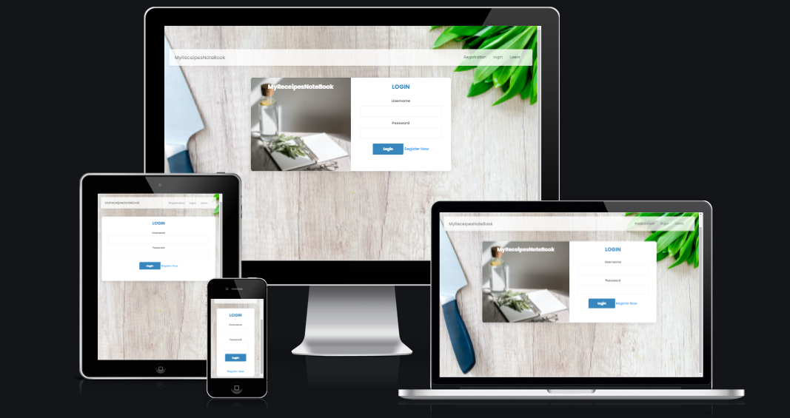

[View Repository in GitHub Pages](https://github.com/Manuperezro/MSP3-data-Base)

[View Deployment link Heroku](https://myrecipes-notebook.herokuapp.com/)

  * [The Why](#the-why)
  * [The Bussines Goal](#the-bussines-goal)
  * [(UX) User Experience:](#-ux--user-experience-)
    + [User Stories](#user-stories)
      - [First time Users Goals:](#first-time-users-goals-)
      - [Returning Users Goals:](#returning-users-goals-)
      - [Frequent Users Goals:](#frequent-users-goals-)
      - [Website Owner Goals:](#website-owner-goals-)
    + [I want users to:](#i-want-users-to-)
  * [Design:](#design-)
    + [Theme and Colour Scheme](#theme-and-colour-scheme)
    + [Design Brief:](#design-brief-)
  * [Wireframes](#wireframes)
  * [Features](#features)
      - [Existing Features:](#existing-features-)
        * [(Main page)](#-main-page-)
  * [Technologies:](#technologies-)
    + [Languages used:](#languages-used-)
    + [Frameworks Libraries and programm used:](#frameworks-libraries-and-programm-used-)
  * [Database Schema:](#database-schema-)
    + [Schema:](#schema-)
  * [Testing:](#testing-)
    + [Testing results:](#testing-results-)
- [Validators Results :](#validators-results--)
- [light House](#light-house)
    + [Bugs and Errors during development:](#bugs-and-errors-during-development-)
      - [Debuging procces :](#debuging-procces--)
      - [Recipes History Not loading.](#recipes-history-not-loading)
      - [Users Login not accesing the Users Table.](#users-login-not-accesing-the-users-table)
      - [push to Heroku rejected](#push-to-heroku-rejected)
  * [Deployment:](#deployment-)
    + [Inception:](#inception-)
      - [Deployment to GitHub Pages:](#deployment-to-github-pages-)
      - [Deployment to Heroku Pages:](#deployment-to-heroku-pages-)
    + [Cloning repository:](#cloning-repository-)
    + [Forking repository:](#forking-repository-)
  * [Credits:](#credits-)
  * [Turorials, guides and courses recources:](#turorials--guides-and-courses-recources-)
  * [Aknowledgements:](#aknowledgements-)

  <small><i><a href='http://ecotrust-canada.github.io/markdown-toc/'>Table of contents generated with markdown-toc</a></i></small>

## The Why

Help the users to keep online recipes that they find in the web in an organize app, where the users can comeback easily to find links and notes about their favourites recipes.

## The Bussines Goal

+ Increase the number of users.  
+ Increase the number of users paying the pro quote (Future feature).

## (UX) User Experience: 

Users will be able to navigate through the web application easily and find the recipes the saved

Users will be able to use the draw service (What do I cook today??) with the minimun amount of clicks , so users can save time in the decision making procces of what to cook.

- ### User Stories

  - #### First time Users Goals:
     - To be able to use the app easily.
     - Uderstand how the app works.
     - To create new receipes cards 
     - To be able to safe the recipes they want.

  - #### Returning Users Goals:
     - To find the list of the recipes saved.
     - To be able to use the draw button quick.
     - To see the history of receipes saved.
     - To be able to see the companies social media.
     
  - #### Frequent Users Goals:
     - To see if there is any new update or feature in the app.
     - To be able to delete recipes that they are not using anymore.

  - #### Website Owner Goals:

  - ### I want users to:

     - To be able to use the web app  intuitive and whithout many instructions.
     - To be able to enjoy the service that the app offers wihtout errors.
     - To save a big number of receipes.
     - To be able to open he link of the receipes with a few clicks.

    ## Design:

   ### Theme and Colour Scheme

The theme is inspired by a chopping board and the elemts that a chef use to prepare a pleasent meal and is intented to appeal a minimalism and clean chopping board. 

A clean and modern colour scheme with contrasting and complementary colours was chosen to reflect a sense of simple energy. Colors was used to generate two colour palettes which were incorporated as utility classes in the CSS file, to be easily called upon directly from the HTML files.

### Design Brief:

+ Colour:

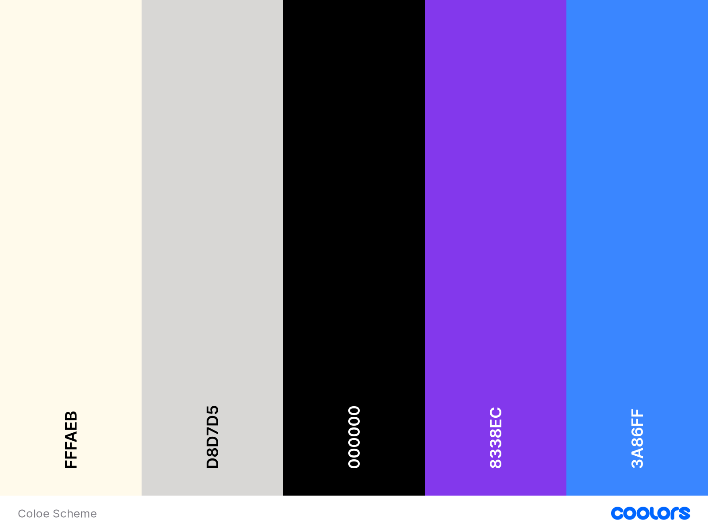

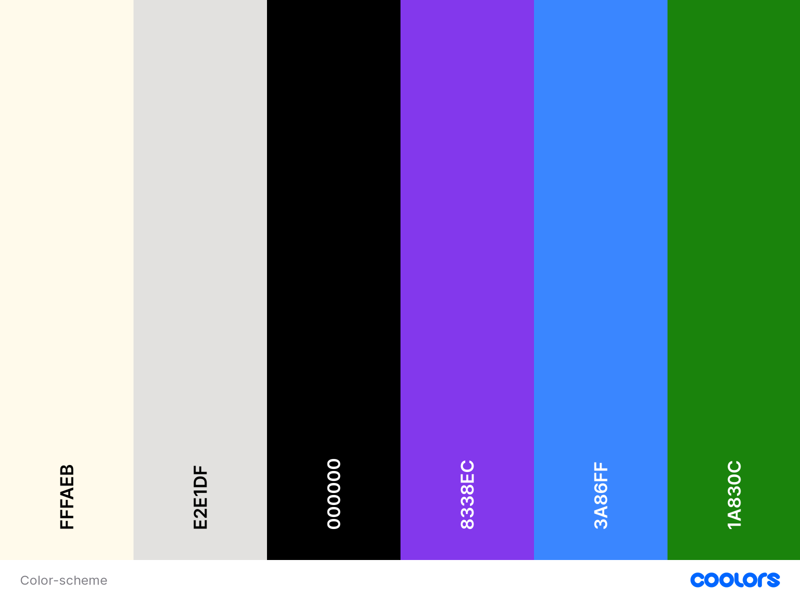

- Links : 

+ Images:

The Background image and the image in the register form was unload from n[Pexels](https://www.pexels.com/es-es/).

- background image:

the goal was to inspire a clean, simple choping board in a bright, clean and minimalism kitchen wich inspire peace and invite to cook. 

- Register and login image:

In this image the goal was to emulate a paper notebook with some elements to create the effect that when you are login into the app, you are opening your paper recipes notebook.

## Wireframes

The Basic structure of My recipes Notebook was skectched using 

  [balsamiq](https://balsamiq.com/).

- PC Mac screen: 

 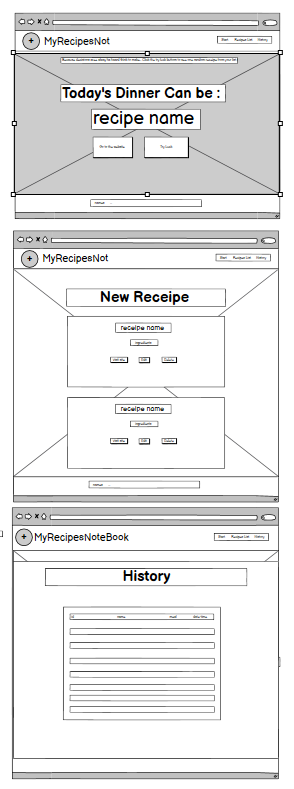

- Tablet screen:

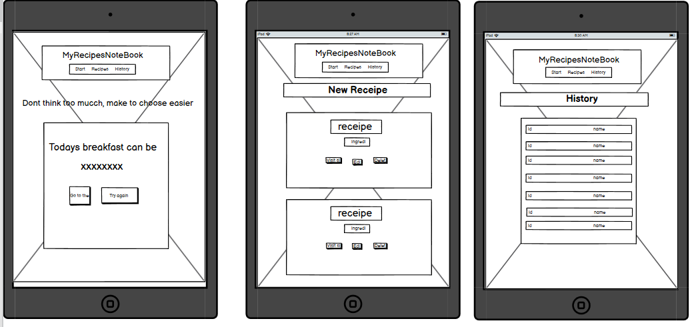

- Mobile screen: 

 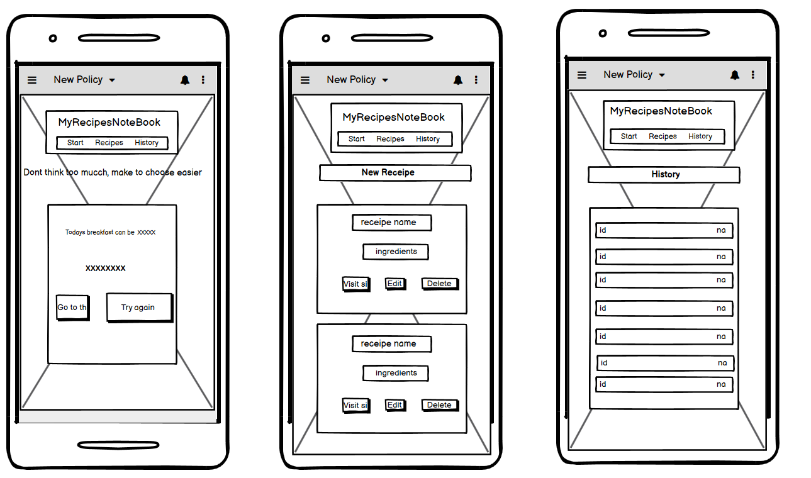

## Features

 - #### Existing Features:

 - ##### (Main page)
     
   + Navigation bar 

   - Navigation Menu: I decided to go with a simple and clean navigation bar to keep the feeling of a clean kitchen which invite to Cook.
      
   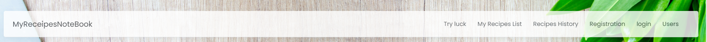

   + What to Cook?,  Draw Box.

   - One of the main features of the app, is that users can click in the what to cook, and this will select a random recipe from the list.

    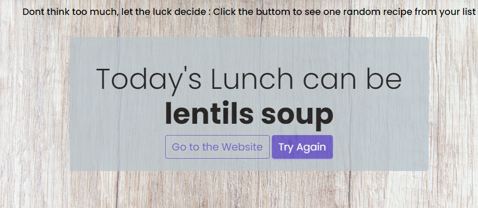

   + Create Recipes

   - The useres are able to click on the create new recipe buttom, and this will open a form wich allow users to create new recipes items and storage in the database.

    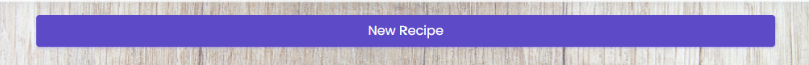

    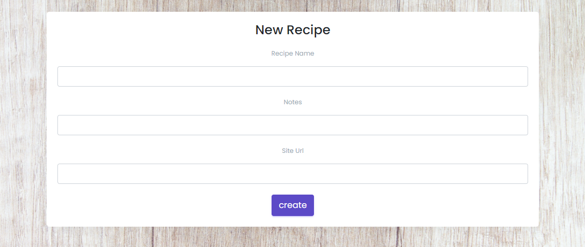

   + Edit and deleted Recipes
   
   - Once the recipes are created they will be able to acces the recipes item and edit, and delete them

    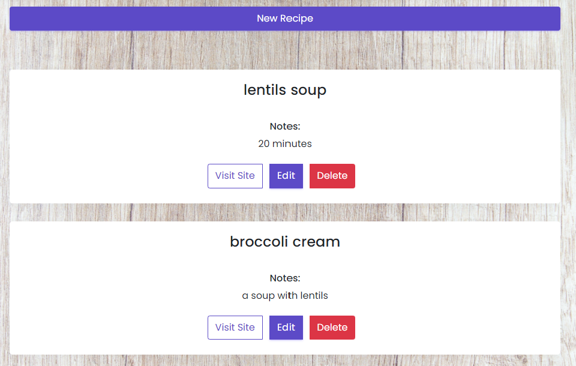

   + Recipes History 

   - I decided to create a list where the users can see every created recipe organize from the latest creation till the oldest.

   Users also can see wich type of meal is, and date and time of creation. 

    

   + Registration and Login Form.

   - I also added a registration and Loging Form, where users can Sign up and register to be able to see their own data.

   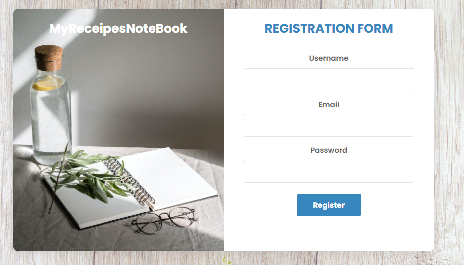

   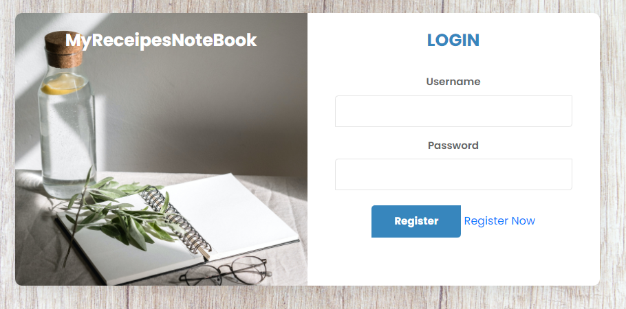
  
## Technologies: 

### Languages used: 

- [HTML](https://en.wikipedia.org/wiki/HTML5)

- [CSS](https://en.wikipedia.org/wiki/CSS)

- [PYTHON3](https://en.wikipedia.org/wiki/Python_(programming_language))

### Frameworks Libraries and programm used: 

- [Bootstrap](https://en.wikipedia.org/wiki/Bootstrap_(front-end_framework)

- [Google Fonts](https://en.wikipedia.org/wiki/Google_Fonts)

- [Font awesome](https://fontawesome.com/v4.7/icons/)

- [Balsamiq](https://balsamiq.com/)

- [Pexels](https://www.pexels.com/)

- [Git](https://git-scm.com/)

- [Gitpod](https://github.com/)

- [Github](https://github.com/)

- [Balsamiq](https://balsamiq.com/)

- [Flask](https://flask.palletsprojects.com/en/2.1.x/)

- [SQLite](https://sqlite.org/index.html)

- [SQAlchemy](https://sqlitebrowser.org/)

- [SQAlchemy](https://regexr.com/)

## Database Schema:

### Schema: 

- To check if my schema was valid, I checked if the tables were achiving to solve the requirements of the tasks. I used DB Browser desktop app:

This image is the databases in DB browser app.

- 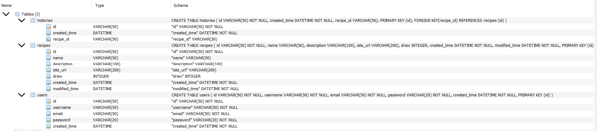

This are the 3 tables I used when started the app.

- 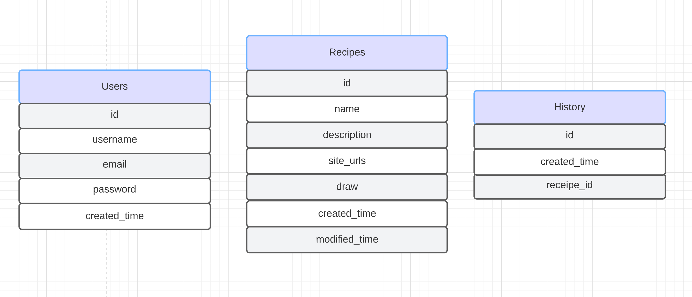

Recipes table

- 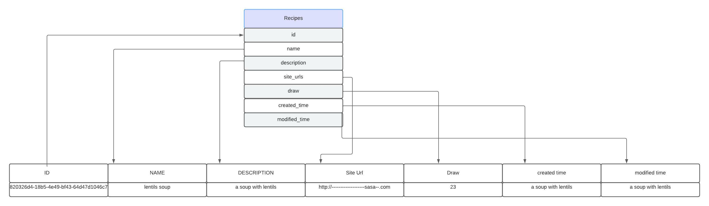

- 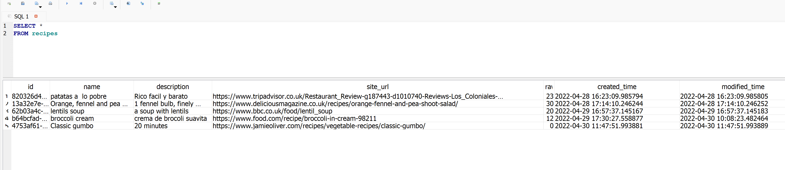

When the app was more developed, I decided to simplify the code and Try to achive the same results in the all History pages, not using the Hystory table.

I lefted commented in the file just for documentation porpuses.

## Testing: 

### Testing results:

- [W3C Markup Validation Service](https://validator.w3.org/)

 + To validate HTML and CSS code.

 - 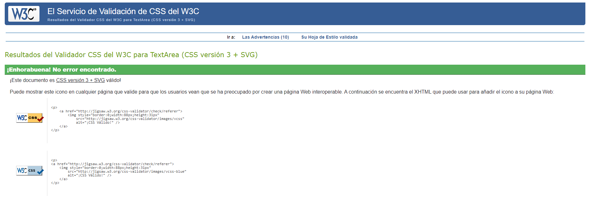

 - There is one error in the HTML and templates, but is regarding the flask the flask syntax, the validator dont recognises Flask syntax as HTML.
 
 - 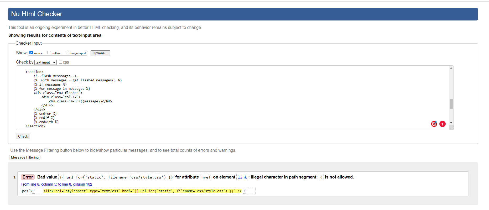
  

 # Validators Results :

# light House

- 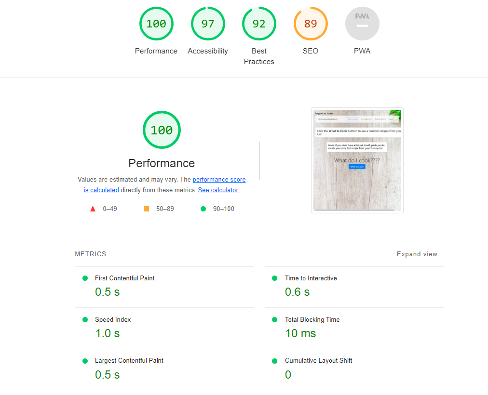

### Bugs and Errors during development:

#### Debuging procces : 

For debugging and testing I used the following tools and techniques : 

+ Manual testing : Where I check manually if the differents features of the project works according the user histories.

+ User testing : Where Myself and others users impersonate the users, this allow me to collect direct feedback from real users, collecting valuables ideas to implement new features and improve the existing ones.

+ loggin I used the command a record.log file to collect differents logs during the development procces, this allow me to see where the code stop working and identify bugs.

In the next image you can see the lines of code I used tu log the results in the lrecord.log file.

- 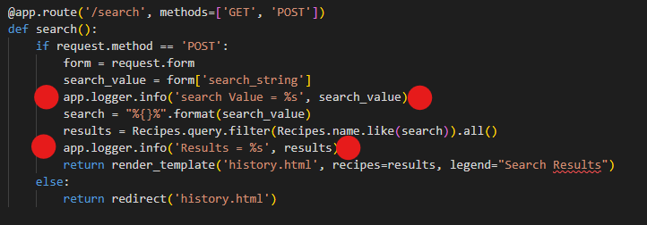

In the next image you can see how the results are log in the record.log file:

- 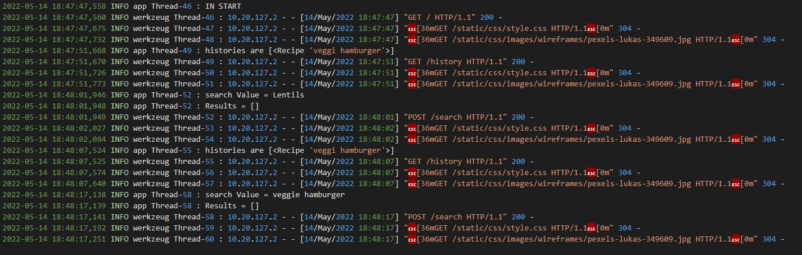

This really help me to identify Bugs and fixed during the development procces.

To be able to use this it is neccesary to type the following lne or code on your main.py file : 

<logging.basicConfig(filename='record.log', level=logging.DEBUG, format=f'%(asctime)s %(levelname)s %(name)s %(threadName)s : %(message)s')>

#### Recipes History Not loading.

The issue :

When I first tryed to create a history page with all the existing recipes in the Recipes page, the template was render ok, but the list was empty, it wasn't receiving the data from the History model.

The solution : 

I tried to simplify the code, and to used what was already working and retriving data, to made the following changes:(Check images below for more details), and try collect the data from the Recipes model, as the results was the same. The user was able to see a list with all the created recipes.

- 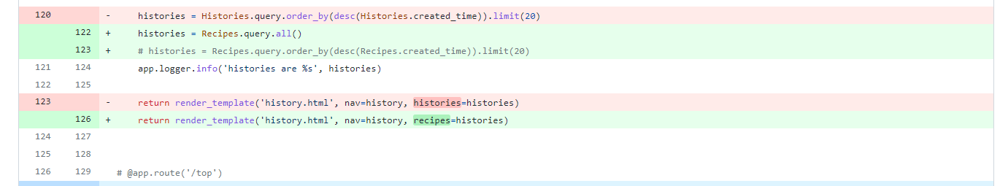

#### Users Login not accesing the Users Table. 

The issue : 

The route for Users registration, was collecting the data into the user table corretly but the route I created for login wasn't collecting any data.

The solution : 

I was using the <reg-form.username.data> to syntax to request the data, and I changes for the <request> method imported from flask <username = request.form.get('username')>

- 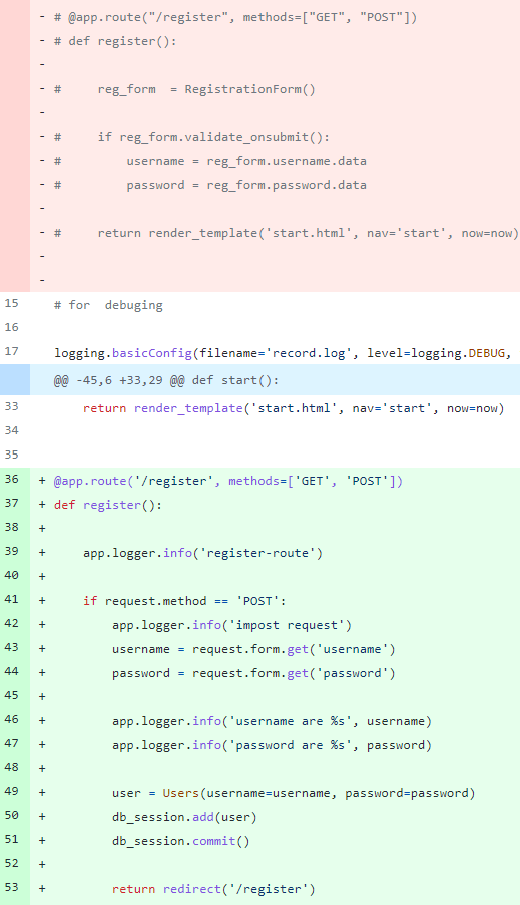

#### Push to Heroku rejected

The issue: 

I was unable to push the changes to Heroku, I got a message saying that the push was rejected. falied to push some modules to my <heroku remote link>

The Solution:

Step-1: I merged all the conflics one by one.

Step-2: I deleted the remote I was usinng and create a new one.

Step-3: I Created a new app in Heroku and push to it.

Problem part 2 :

After I add some of the variables to the gitignore file, Heroku was giving me an error in the logs, that wasn't able to find the env.py file, and some modules, 

The solution:

After read a lot in Stackoverflow I tryed to change a bit the file structure, in the way i was working with the enviromental files, instead of using the env.py I am using .env wich has a slightly different structure, but Heroku is working ok now.

#### Css link not loading.

The issue:

The css style wasn't loading and the site didn't have any style, I was only able to see the code using the <Style> script at the bottom of the body in html.

The file path was wrong.

The solution:

I change the file path, modifications in the image below:

- 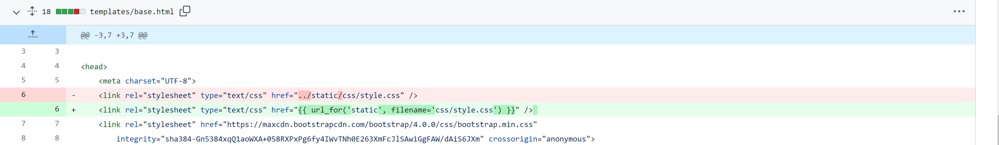

As I changed the file path for the CSS file I have to changes in the images too:

- 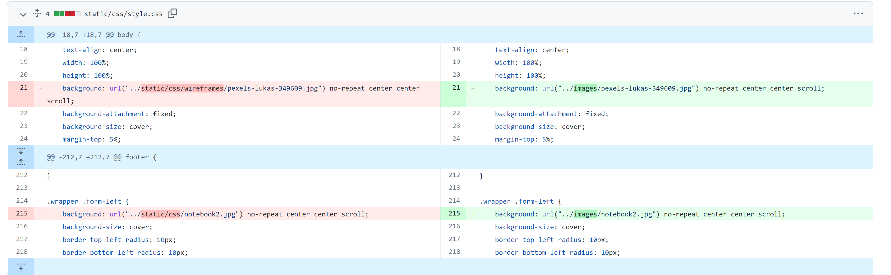

#### Users Login accepting Users with wrong password.

The Issues:

1-The login code aBle users to login with a Wrong password, it catch the error if the imput field is empty, but not if is a different password. Oprning the users name sesion.

2-Not accepting the password hash as valid.

The Solution:

    Steps: 
    1- I mannage to get the username and password hash form the Users table.
    2- I cath the errors when the imput fields are empty with anf if statement.
    3- I try to handle the I users Not exist with this specific code:

    <           if userExists is True:
                # get the user from the database
                user = Users.query.filter(Users.username == username and Users.password == password).first()
                session['username'] = user.username
                session['password'] = user.password
                session['userId'] = user.id
                session['loggedIn'] = True
                flash(f"Welcomeback, {session.get('username')}!")
                return redirect('/') 
                return render_template('start.html')
            else:
                # account dosn't exist
                errorMessage = "Invalid Username or Password "
                app.logger.info('errorMessage %s', errorMessage)>

    Final solution:

  - 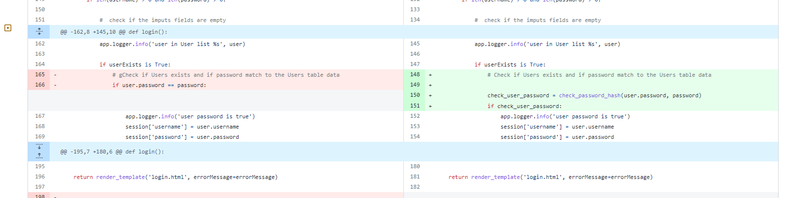

## Deployment:

### Inception:

 + this project was created using Code Institute template from GitHub:

 + After the creation of the project, I rename it as : The-Climbing-Club-MS2.

 + In order to push this project from GitPod to Github I used a set of git commands on the terminal: 
  
- git status  - Check the status of the repository and see if there were any changes in files 

- git add .  - Add the files that were modified/created, so we can commit it 

- git commit -m "message for commit"  - Commits all the changes

- git push  - Pushes all committed versions to GitHub.

#### Deployment to GitHub Pages:

+ The project was deployed to GitHub Pages using the following steps:

- Log in to GitHub and locate GitHub Repository

- At the top of repository click on "Settings"

- Once you are in settings scroll down to "GitHub Pages"

- Under "Source", click the dropdown called "None" and select "Master Branch".

- After the page automatically refresh scroll down again on "GitHub Pages" and I will  see live link to the published site.

#### Deployment to Heroku Pages:

+ The project was deployed on Heroku from the master branch. To do this, the following steps were taken:

- from your terminal (CLI), create a requirements.txt and Procfile using these commands:#

  -- pip3 freeze --local > requirements.txt
  -- echo web: python app.py > Procfile

- Sign up and login to Heroku, create a new app

- Go to the Deploy tab and then Deployment Method and select Github

- Under Connect to Github enter your details and connect your repository

- Next, go to settings and select Config Vars and then Reveal Config Vars

- You need to enter the following variables to match what you have stored in your env.py file

  -- IP : 0.0.0.0
  -- PORT : 5000
  -- DATABASE_URI : DATABASE_URI",
  -- SECRET_KEY : <app secret key>

- Under the Deploy tab go to Automatic Deploys and enable

- Under Manual Deploy, choose Master and click Deploy Branch

- Heroku will begin building the app. When it is ready, you can click Open app to launch it.

### Cloning repository:

+ Local Clone

- Log in to GitHub and locate GitHub Repository

- At the top of repository click on Code

- From the dropdown menu under HTTPS copy the link

- Now on the IDE create a directory where you want to make the clone

- Type git clone and paste the link that you copy from step 3.

### Forking repository:

By forking the GitHub Repository we make a copy of the original repository on our GitHub account to view and/or make changes without affecting the original repository by using the following steps:

- Log in to GitHub and locate the GitHub Repository
- At the top of the Repository (not top of page) just above the "Settings" Button on - - the menu, locate the "Fork" Button.
- You should now have a copy of the original repository in your GitHub account.

## Credits:

## Turorials, guides and courses recources:

- Main Code structure, Flask, Python, Html, Css:

  HTML Templates : 

  [Udemy SQL flask CRUD](https://www.udemy.com)

  [HTML and CSS](https://www.w3schools.com/howto/howto_js_todolist.asp)

  [HTML and CSS](https://medium.com/claruswaymaking-a-todo-list-with-html-css-and-javascript-154839b770b6)
  
  CRUD:

  [Udemy SQL flask CRUD](https://www.udemy.com)

  [Python and Flask](https://www.youtube.com/watch?v=6L3HNyXEais&ab_channel=TheProgrammerinYou)

  [Python and flask](https://www.youtube.com/watch?v=dam0GPOAvVI&t=198s&ab_channel=TechWithTim)

- SQlite Doumentation Guides

- Postgress Documentation

- Bootstrapt Documentations Guides.

- Database: 

 Coding with Mosh, MySQL course.

  [loging tutorial](https://www.youtube.com/watch?v=7S_tz1z_5bA&t=6472s)

- Login form With flask.

  [loging tutorial](https://www.youtube.com/watch?v=8aTnmsDMldY&t=1040s)

  [loging tutorial](https://www.youtube.com/watch?v=71EU8gnZqZQ&t=1107s&ab_channel=ArpanNeupane)

## Aknowledgements:

A huge thank you to my mentor who has been incredibly helpful and approchable throughout this project.

Likewise, to the tutors for helping through to completion on this.

And to the facilitators at the City of Bristol College: Pasquale and Ben for their time and energy.

Big Thanks.
