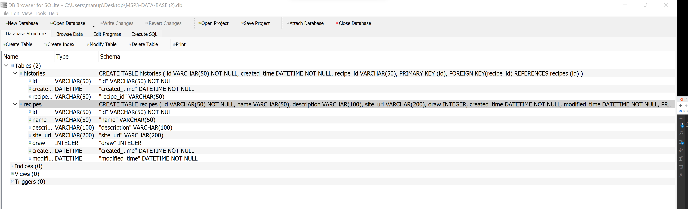

# My Receipes Note Book

# A responsive web apllication where the  users can store recipes and also use th draw buttom to help then to make decision of what to cook.

## Code Institute - Milestone Project 3

## HTML/ CSS / Python / Flask / SQAlchemy / SQLite - Backend Development Milestone Project 3.

### By Manuel Perez

[View Repository in GitHub Pages] ()

[view Website Link ] ()

<small><i><a href='http://ecotrust-canada.github.io/markdown-toc/'>Table of contents generated with markdown-toc</a></i></small>

## The Why

Help the users to keep al the online recipes that the find in the web in an orgaize app, where the users can comeback easyly to find links and notes about their favourites receipes.

## The Bussines Goal

+ Increase the number of users.  
+ Increase the number od useres paying the pro quote (Future feature).

## (UX) User Experience: 

Users will be able to navigate through the web application easy and find the recipes the saved

Users will be able to use the draw service (What do i cook today??) with the minimoun amount of clicks , so users can save time in the decision maker procces on what to cook.

- ### User Stories

  - #### First time Users Goals:
     - To be able to use the app easyly.
     - Uderstand how the app works.
     - to create new receipes cards 
     - To be able to safe the recipes they want.

  - #### Returning Users Goals:
     - To find the list of the recipes saved.
     - To be able to use the draw button quick.
     - To see the history of receipes saved.
     - To be able to see the companies social media.
     
  - #### Frequent Users Goals:
     - To see if there is any new update or feature in the app.
     - To be able to deleted the recipes they are not using anymore.
     - To be able to clean the recipes history

  - #### Website Owner Goals:

  - ### I want users to:

     - To be able to use the web app  intuitive and whitout many instructions.
     - To be able to enjoy the service the app offers wihtout errors.
     - To save a big number of receipes.
     - To be able to open he link of the receipes with a few clicks.

    
    ## Design:

   ### Theme and Colour Scheme

The theme is inspired by a chopping borad and the elemts a chef used to prepare a pleasent meal and is intended to appeal a minimalism and clean chopping board. A clean and modern colour scheme with contrasting and complementary colours was chosen to reflect a sense of simple energy. Coolors was used to generate two colour palettes which were incorporated as utility classes in the CSS file, to be easily called upon directly from the HTML files.

### Design Brief:

+ Colour:

- Links : 

+ Typography:

+ Images:

The Backgorund image and the image in the register form was unload from n[Pexels](https://www.pexels.com/es-es/).

- background image:

the goal was to inspire a clean, simple choping board in a bright, clean and minimalis kitchen wich inspire peace and invite to cook. 

- Register and login image:

In this image the goal was to emulate a paper notebook with some elements to create the effect that when you are login into the app, you are opening your paper recipes notebook.

## Wireframes

The Basic structure of My receipes Notebook was skectched using 

  [balsamiq](https://balsamiq.com/).

Here some images of the proccess(to see full wireframe click PDF) : 

- PC Mac screen: 

 

- Tablet screen:

- Mobile screen: 

 

## Features

 - #### Existing Features:

 - ##### (Main page)
     
   + Navigation bar 

   - Navigation Menu: I decided to go wiht a simple and clean navigation bar to keep the feeling of a clean empty chopping board    wich invite to Cook.
      
   

   + What to it,  Draw Box.

   - One of the main features of the app, is that users can click in the Try luck buttom, and this will select a random recipe from the users recipe list.

    

   + Create Recipes

   - The useres are able to click on the create new recipe buttom, and this will open a form wich allow users to create new recipes items and storage in the database.

    

    

   + Edit and deleted Recipes
   
   - Once the recipes are created they will be able to acces the recipes item and edit, and delete them

    

   + Recipes History 

   - I decided to create a list where the users can see every created recipe organize from the lates creation till the oldest, it also can see wich type of meal is, and date and time of creation. 

    

   + Registration and Login Form.

   - I also addded a registration and Loging Form, where useres can Sign up and register to be able to see their one data.

   

   

   

  - ##### Receips()

 
   

   - ##### History()

  
## Technologies: 

### Languages used: 

- [HTML](https://en.wikipedia.org/wiki/HTML5)

- [CSS](https://en.wikipedia.org/wiki/CSS)

- [PYTHON3](https://en.wikipedia.org/wiki/Python_(programming_language))

### Frameworks Libraries and programmes used: 

- [Bootstrap](https://en.wikipedia.org/wiki/Bootstrap_(front-end_framework)
  
- [Google Fonts](https://en.wikipedia.org/wiki/Google_Fonts)

- [Font awesome](https://fontawesome.com/v4.7/icons/)

- [Balsamiq](https://balsamiq.com/)

- [Pexels](https://www.pexels.com/)

- [Git](https://git-scm.com/)

- [Gitpod](https://github.com/)

- [Github](https://github.com/)

- [Balsamiq](https://balsamiq.com/)

- [Flask](https://flask.palletsprojects.com/en/2.1.x/)

- [SQLite](https://sqlite.org/index.html)

- [SQAlchemy](https://www.sqlalchemy.org/)

## Database Schema:

### Schema: 

- To check if my schema was ok, and tables I was creating were matching the requirements of the tasks I used DB Browser desktop app:

- 

- 

- 

## Testing: 

### Testing results:

- [W3C Markup Validation Service](https://validator.w3.org/)

 + To validate HTML and CSS code.

 - [Js Hint Validation Service](https://jshint.com/)

 + To validate JavaScript code.

 # Validators Results :

# light House

### Testing User Stories from User Experience (UX) Section

 #### First Time Visitor Goals: 

  ######  As a First Time Visitor, I want to easily see what the products offers is, be able to find how to contact the organization and to navigate easyly throught the site:
     
    

  #####  As a First Time Visitor, I want to be able to navigate easyly and intuitive throughout the site to find content related the products that the company offer and tools to decided / plan holidays:

  ##### As a first time visitor I want to see some stories and reviews from other ussers to get to know the organization. I also Want to find the links to the social media to find more information about the organization and users thoughts and reviews and be able to determine how trasted and known the studio is:

  #### Returning Visitor Goals: 

  ##### As a returning Visitor, I want to find the products that I already seen and relevant information about them :
   

  
  ##### As a returning Visitor, I want to be abel to send an enquery in simple steps:

  ##### As a Returning Visitor, I want to find the best way to get in contact with the organisation with any questions I may have:

 #### Frequent Users Goals:

##### As a Frequent User, I want to be able to book a class easyly:

### Bugs and Errors during development:

- Recipes History Not loading.

The issue :

When I first tryed to create a history page with all the existing recipes in the Recipes page, the template was render ok, but the list was empty, it wasen't passing the data from the History model.

The solution : 

I tried to simplify the code, and to used what was already working and retieving data, So made the following changes (Check images below for more details), and try collect the data from the Recipes model, as the results was the same. The user was able to see a list with all the created recipes.

- 

## Deployment:

### Inception:

 + this project was created using Code Institute template from GitHub:

 + After the creation of the project, I rename it as : The-Climbing-Club-MS2.

 + In order to push this project from GitPod to Github I used a set of git commands on the terminal: 
  
- git status  - Check the status of the repository and see if there were any changes in files 

- git add .  - Add the files that were modified/created, so we can commit it 

- git commit -m "message for commit"  - Commits all the changes

- git push  - Pushes all committed versions to GitHub.

#### Deployment to GitHub Pages:

+ The project was deployed to GitHub Pages using the following steps:

- Log in to GitHub and locate GitHub Repository

- At the top of repository click on "Settings"

- Once you are in settings scroll down to "GitHub Pages"

- Under "Source", click the dropdown called "None" and select "Master Branch".

- After the page automatically refresh scroll down again on "GitHub Pages" and I will  see live link to the published site.

#### Deployment to Heroku Pages:

+ The project was deployed on Heroku from the master branch. To do this, the following steps were taken:

- from your terminal (CLI), create a requirements.txt and Procfile using these commands:#

  -- pip3 freeze --local > requirements.txt
  -- echo web: python app.py > Procfile

- Sign up and login to Heroku, create a new app

- Go to the Deploy tab and then Deployment Method and select Github

- Under Connect to Github enter your details and connect your repository

- Next, go to settings and select Config Vars and then Reveal Config Vars

- You need to enter the following variables to match what you have stored in your env.py file

  -- IP : 0.0.0.0
  -- PORT : 5000
  -- DATABASE_URI : DATABASE_URI",
  -- SECRET_KEY : <app secret key>

- Under the Deploy tab go to Automatic Deploys and enable

- Under Manual Deploy, choose Master and click Deploy Branch

- Heroku will begin building the app. When it is ready, you can click Open app to launch it.

### Cloning repository:

+ Local Clone

- Log in to GitHub and locate GitHub Repository

- At the top of repository click on Code

- From the dropdown menu under HTTPS copy the link

- Now on the IDE create a directory where you want to make the clone

- Type git clone and paste the link that you copy from step 3.

### Forking repository:

By forking the GitHub Repository we make a copy of the original repository on our GitHub account to view and/or make changes without affecting the original repository by using the following steps:

- Log in to GitHub and locate the GitHub Repository
- At the top of the Repository (not top of page) just above the "Settings" Button on - - the menu, locate the "Fork" Button.
- You should now have a copy of the original repository in your GitHub account.

## Credits:

## Tutorials:

- CodeLab tutorials (Youtube tutorials).

- Owl carousel (Youtube tutorials).

- openweather API guides.

- Shanji Rajai,  2 Steve Griffin  Profesor youtube tutorials OpenWeather Api.

- Google Map Api Guides.

- Bootstrapt Documentations Guides.

## Aknowledgements:

A huge thank you to my mentor who has been incredibly helpful and approchable throughout this project.

Likewise, to the tutors for helping through to completion on this.

And to the facilitators at the City of Bristol College: Pasquale and Ben for their time and energy.

Big Thanks.
